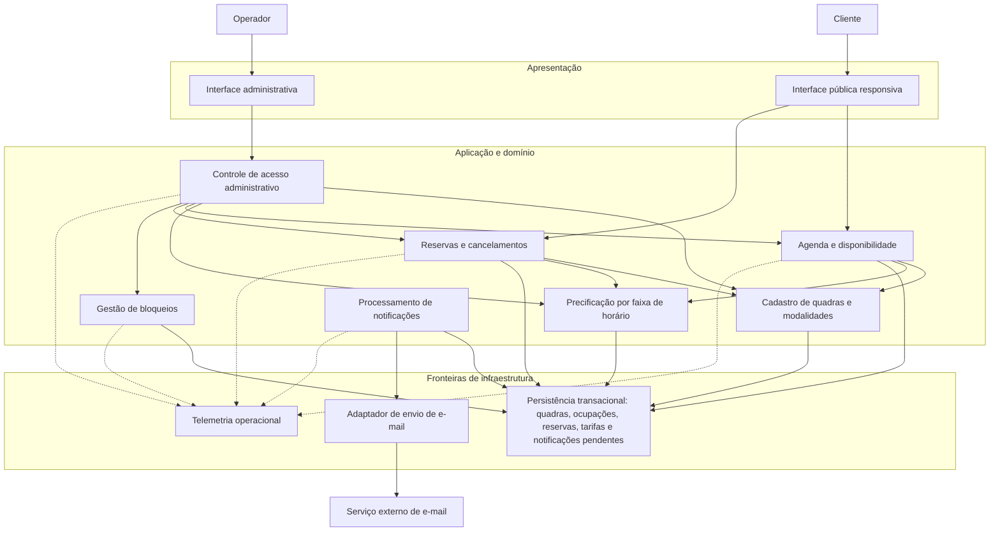
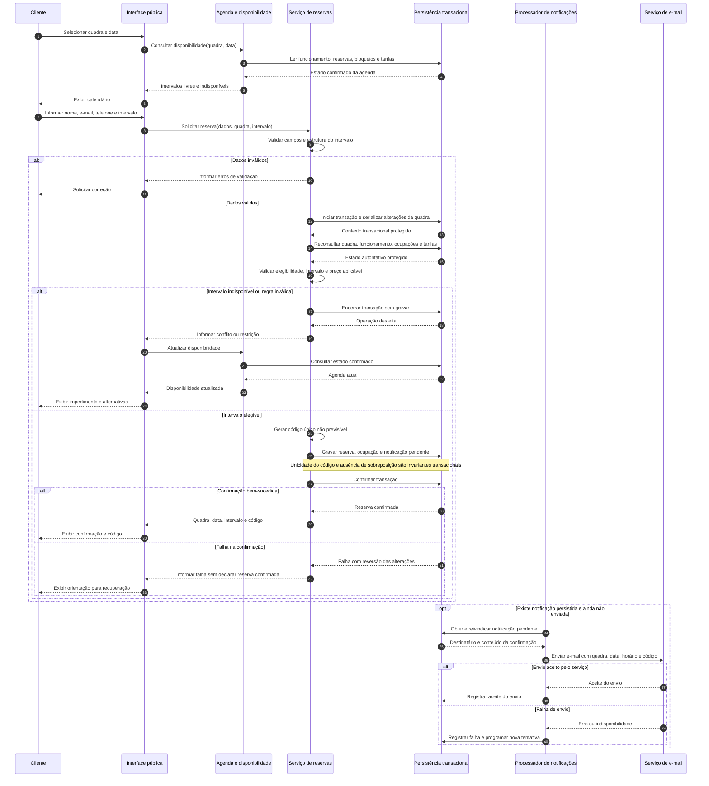
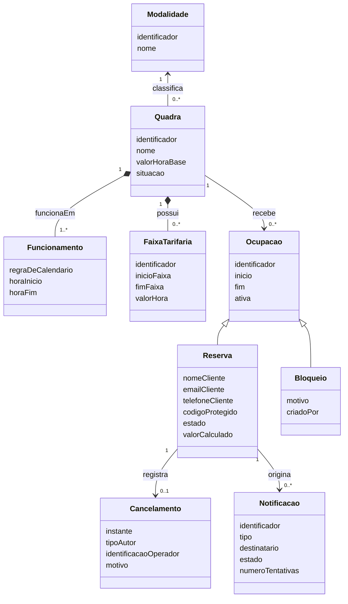

# Relatório Técnico de Arquitetura de Software

**Projeto:** Reservas para Quadras Esportivas — P05  
**Equipe:** AI4ES — Time 2  
**Escopo:** arquitetura lógica, interfaces conceituais, rastreabilidade e governança dos requisitos apresentados.  
**Status:** proposta arquitetural com decisões sujeitas às pendências registradas neste relatório.

## 1. Identificação das HUs

| HU | Perfil | Objetivo | Critérios de aceite arquiteturalmente relevantes | RF relacionados |
|---|---|---|---|---|
| HU01 | Operador | Cadastrar quadra | Nome, tipo e valor da hora obrigatórios; quadra imediatamente visível na disponibilidade. | RF01 |
| HU02 | Operador | Bloquear horários | Bloqueios não aparecem como disponíveis; operador pode remover bloqueio a qualquer momento. | RF03 |
| HU03 | Operador | Consultar agenda consolidada | Exibir todas as quadras, com horários livres e reservados; permitir navegação por data. | RF11 |
| HU04 | Operador | Cancelar reserva com justificativa | Motivo obrigatório; cliente notificado por e-mail. | RF09 |
| HU05 | Cliente | Consultar disponibilidade sem cadastro | Acesso público pelo navegador; horários ocupados exibidos como indisponíveis. | RF04, RF07 |
| HU06 | Cliente | Realizar reserva | Validar disponibilidade na confirmação; exibir código na tela e enviá-lo por e-mail. | RF05, RF06, RF07, RF10 |
| HU07 | Cliente | Cancelar a própria reserva | Exigir código válido; liberar imediatamente a ocupação gerada pela reserva. | RF08 |

### 1.1 Complementos e divergências entre as fontes

- **RF02 — editar/remover quadra:** não possui HU correspondente.
- **RF12 — valores por faixa de horário:** não possui HU nem critérios de aceite próprios.
- **HU02:** acrescenta a remoção de bloqueios, não explicitada em RF03.
- **HU04:** acrescenta o e-mail de cancelamento pelo operador, não explicitado em RF09 ou RF10.
- **RF01:** exige informar horário de funcionamento, mas HU01 não o inclui entre os campos obrigatórios. A obrigatoriedade e o formato precisam ser harmonizados.
- **RNF01–RNF07:** são requisitos transversais; sua cobertura exige decisões e verificações adicionais às HUs.

**Regra de rastreabilidade:** todos os requisitos explícitos e critérios de aceite integram o escopo. Decisões técnicas propostas e regras de negócio ainda indefinidas são identificadas como tais, sem substituírem a especificação original.

## 2. Diagramas de Arquitetura (Mermaid)

### 2.1 Visão lógica de componentes

A proposta é uma **aplicação modular**, com responsabilidades separadas e uma fronteira transacional comum para operações que alteram a ocupação das quadras. Os componentes abaixo não implicam serviços implantados separadamente.

**Fronteiras importantes:**

- Consultas e operações do cliente não exigem conta.
- Operações administrativas exigem autenticação e autorização no servidor, independentemente da interface utilizada.
- Agenda pública e agenda administrativa compartilham as regras de ocupação, mas expõem informações diferentes.
- O serviço externo de e-mail não participa da transação de confirmação da reserva.
- A persistência concentra as garantias de integridade; verificações apenas na interface são insuficientes.

### 2.2 Sequência de confirmação de reserva

**Garantia central:** duas solicitações concorrentes para intervalos sobrepostos na mesma quadra não podem ser confirmadas. A consulta inicial é informativa; a decisão final ocorre dentro da transação protegida.

O diagrama representa falhas conhecidas com reversão. A perda de comunicação após uma confirmação efetiva exige tratamento de resultado indeterminado, descrito na Seção 3.

### 2.3 Modelo conceitual de domínio

O modelo não cria uma entidade de conta de cliente: os contatos pertencem à reserva. `valorCalculado` é uma proposta para preservar o valor aplicado no momento da confirmação; não representa cobrança ou pagamento, ausentes do escopo.

## 3. Decisões de Arquitetura

### DA01 — Modularidade com consistência transacional compartilhada

**Decisão:** separar apresentação, aplicação, domínio e infraestrutura, mantendo reservas, bloqueios e ocupação em uma fronteira transacional consistente.

**Justificativa:** atender RNF05 e RNF07 sem introduzir coordenação distribuída desnecessária.

**Consequência:** módulos possuem contratos próprios, mas não precisam ser serviços independentes. Modalidades são dados configuráveis, evitando regras fixas por esporte na interface e no fluxo de reservas.

### DA02 — Interfaces conceituais orientadas a casos de uso

| Interface | Operações conceituais |
|---|---|
| Cadastro de quadras | `cadastrarQuadra`, `editarQuadra`, `removerQuadra` |
| Disponibilidade | `consultarDisponibilidade(quadra, data)` |
| Agenda administrativa | `consultarAgendaDiaria(data)` |
| Reservas | `confirmarReserva(dadosContato, quadra, intervalo)` |
| Cancelamentos | `cancelarPorCodigo(codigo)`, `cancelarPeloOperador(reserva, motivo)` |
| Bloqueios | `criarBloqueio(quadra, intervalo, motivo)`, `removerBloqueio(bloqueio)` |
| Precificação | `configurarFaixas`, `calcularValor(quadra, intervalo)` |
| Acesso administrativo | `autenticarOperador`, `autorizarOperacao` |
| Notificações | `registrarNotificacao`, `processarPendencias`, `registrarResultado` |

As interfaces devem distinguir erros de validação, conflito de ocupação, acesso negado e falha operacional, sem expor detalhes internos.

### DA03 — Invariantes de agenda e concorrência

**Decisões propostas:**

- Representar intervalos como **[início, fim)**: o início é incluído e o fim excluído. Assim, reservas consecutivas podem ser adjacentes.
- Validar `início < fim` e enquadramento no funcionamento.
- Impedir sobreposição entre ocupações ativas da mesma quadra.
- Serializar por quadra as alterações que afetam sua agenda, ou utilizar mecanismo equivalente que ofereça a mesma garantia.
- Incluir nessa coordenação reservas, bloqueios, cancelamentos e alterações relevantes de funcionamento.

A consulta de disponibilidade não constitui promessa de reserva. Somente a confirmação transacional estabelece a ocupação.

**Conflito ainda não especificado:** criação de bloqueio sobre reserva existente. Até decisão de negócio, a proposta conservadora é rejeitar o bloqueio conflitante, sem cancelar reservas silenciosamente.

### DA04 — Confirmação, código e notificações persistidos de forma consistente

**Decisão:** gravar reserva, ocupação e intenção de envio do e-mail na mesma transação.

- O código deve ser único e não previsível.
- Uma eventual colisão deve gerar novo código antes da confirmação.
- O sucesso ao cliente somente é retornado após a confirmação da transação.
- O envio de e-mail ocorre posteriormente, com tentativas controladas e monitoramento.
- Falha de e-mail não cancela a reserva confirmada.
- A mesma estratégia é aplicada ao e-mail obrigatório de cancelamento pelo operador.

**Limite da garantia:** aceite pelo serviço de e-mail não comprova entrega na caixa postal. Também não se presume envio exatamente uma vez; falhas após o aceite podem causar repetição. O processamento deve reduzir duplicações e manter rastreabilidade.

### DA05 — Cancelamento seguro e liberação consistente

**Cliente:** apresentação de código válido autoriza o cancelamento da reserva correspondente, sem exigir login.

**Operador:** autenticação e autorização são obrigatórias; o motivo deve ser não vazio e persistido com a identificação do operador.

Em ambos os casos:

1. Localizar e validar a reserva.
2. Aplicar a transição de estado na transação.
3. Desativar sua ocupação.
4. Registrar o cancelamento.
5. Quando exigido, persistir a notificação.
6. Confirmar e atualizar a disponibilidade.

O cancelamento libera imediatamente **a ocupação da reserva**. O horário só será apresentado como livre se também satisfizer funcionamento e demais restrições vigentes.

**Proposta técnica:** repetir um cancelamento já realizado não produz nova transição nem nova notificação. Prazo limite e cancelamento de reservas passadas permanecem pendentes.

### DA06 — Código de confirmação tratado como credencial

Como o código permite cancelar a reserva:

- Gerá-lo com aleatoriedade apropriada.
- Proteger transporte, armazenamento e conteúdo das notificações.
- Evitar sua exposição em registros operacionais e endereços de navegação.
- Limitar tentativas abusivas de validação.
- Não expor nome, telefone ou e-mail na agenda pública.
- Aplicar controle de acesso no servidor a todas as operações administrativas.

Os registros necessários ao envio podem conter o código sob proteção e retenção restritas. O mecanismo de autenticação do operador ainda precisa ser definido.

### DA07 — Disponibilidade e desempenho sem sacrificar consistência

**Decisão inicial:** consultar uma representação autoritativa da agenda, com acesso eficiente por quadra, data e intervalo.

- Evitar consultas individuais repetitivas para cada horário ou quadra.
- Não colocar o serviço de e-mail no caminho crítico da consulta ou confirmação.
- Garantir que leituras iniciadas após cadastro, bloqueio ou cancelamento confirmado reflitam o novo estado.
- Otimizações com cópias de leitura ou cache só podem ser introduzidas com garantia explícita de atualização compatível com os critérios de imediatismo.

O prazo de dois segundos será validado por teste de desempenho. A definição de carga, rede, volume e marco de medição ainda está pendente.

### DA08 — Preço calculado de maneira consistente

**Decisão proposta:** usar o valor base quando não houver faixa diferenciada aplicável e registrar o valor calculado na confirmação.

Alterações futuras de tarifa não devem modificar silenciosamente o valor registrado em reservas existentes.

**Dependências de negócio:** moeda, frações de hora, arredondamento, faixas sobrepostas e reservas que atravessam faixas precisam de regras aprovadas. Não se inclui pagamento na arquitetura.

### DA09 — Resiliência, observabilidade e recuperação de requisições

A arquitetura prevê:

- Monitoramento de disponibilidade, latência, erros e conflitos de reserva.
- Monitoramento de idade das notificações pendentes e falhas de envio.
- Verificações de saúde e procedimentos de recuperação.
- Cópias de segurança e testes de restauração, com metas ainda a definir.
- Registros de alterações administrativas sem exposição desnecessária de dados pessoais.
- Estratégia de implantação e recuperação compatível com RNF04.

**Proposta adicional:** usar identificador de requisição para tornar a confirmação idempotente. Se a resposta se perder depois da confirmação, uma repetição com o mesmo identificador deve recuperar o resultado original, não criar outra reserva. O contrato e o prazo de retenção desse identificador devem ser definidos.

## 4. Tabela de Componentes e Rastreabilidade

| Componente | Responsabilidade Principal | Comunica-se com | Origem (HU / Critério de Aceite) |
|---|---|---|---|
| Interface pública responsiva | Consultar horários, coletar contatos, exibir código e permitir cancelamento sem conta. | Agenda; Reservas e cancelamentos. | HU05: acesso sem login; HU06: informar dados e exibir código; HU07: cancelar por código. RNF01, RNF06. |
| Interface administrativa | Manter quadras, bloqueios e tarifas; apresentar agenda consolidada e cancelamentos. | Controle de acesso; módulos administrativos autorizados. | HU01–HU04; RF02 e RF12 sem HU própria. |
| Controle de acesso administrativo | Autenticar operador e autorizar cada operação protegida. | Interface administrativa; módulos de aplicação; telemetria. | HUs do operador; requisito transversal RNF03. |
| Cadastro de quadras e modalidades | Manter nome, modalidade, funcionamento e valor base; gerir edição e remoção. | Persistência; Agenda; Reservas. | HU01: campos e publicação imediata; RF01, RF02; RNF07. |
| Gestão de bloqueios | Criar e remover restrições temporais com consistência frente às reservas. | Persistência; controle de acesso. | HU02: ocultar disponibilidade e permitir remoção; RF03. |
| Agenda e disponibilidade | Calcular horários livres/indisponíveis e consolidar todas as quadras por data. | Cadastro; Precificação; Persistência; interfaces. | HU03: todas as quadras e navegação por data; HU05: consulta pública e ocupações indisponíveis. |
| Reservas e cancelamentos | Validar dados, confirmar atomicamente, gerar código e executar cancelamentos. | Cadastro; Precificação; Persistência; interfaces. | HU06: revalidação e código; HU07: código válido e liberação; HU04: motivo obrigatório. RF05–RF09. |
| Precificação por faixa | Manter tarifas e calcular valor conforme intervalo. | Cadastro; Agenda; Reservas; Persistência. | HU01: valor da hora; RF12 sem HU ou critérios próprios. |
| Persistência transacional | Garantir integridade de ocupações, unicidade, estados e notificações pendentes. | Módulos de domínio; Processador de notificações. | HU06: disponibilidade na confirmação; HU07: liberação imediata; RF06, RF07; RNF05. |
| Processador de notificações | Processar envios persistidos, controlar tentativas e registrar resultados. | Persistência; Adaptador de e-mail; telemetria. | HU06: código por e-mail; HU04: notificação de cancelamento; RF10. |
| Adaptador de e-mail | Isolar contrato e falhas da integração externa. | Processador de notificações; serviço externo de e-mail. | HU04 e HU06; RF10. |
| Telemetria operacional | Medir disponibilidade, latência, falhas e ações administrativas relevantes. | Controle de acesso; Agenda; Reservas; Bloqueios; Notificações. | Suporte transversal a RNF02, RNF03, RNF04 e RNF05; sem HU específica. |

## 5. Bloqueios e Pendências

As pendências abaixo não impedem a estrutura modular inicial, mas impedem fechar regras ou comprovar determinados requisitos.

| ID | Pendência | Consequência | Responsável sugerido | Prioridade |
|---|---|---|---|---|
| P01 | Definir duração mínima/máxima, granularidade, fuso horário e reservas atravessando dias. | Bloqueia contrato definitivo de intervalos e calendário. | Produto e operação | Alta |
| P02 | Definir tratamento de bloqueio sobre reserva existente e alterações de funcionamento com reservas futuras. | Bloqueia comportamento seguro de manutenção da agenda. | Produto e operação | Alta |
| P03 | Definir remoção de quadras com histórico ou reservas futuras. | Bloqueia semântica final de RF02 e regras de integridade. | Produto e desenvolvimento | Alta |
| P04 | Definir precedência tarifária, moeda, arredondamento e divisão por faixas. | Bloqueia cálculo verificável de RF12. | Produto | Alta |
| P05 | Definir identidade dos operadores, recuperação de acesso e permissões. | Bloqueia detalhamento de RNF03. | Produto e segurança | Alta |
| P06 | Definir prazo de cancelamento, reservas passadas e recuperação de código perdido. | Impede concluir exceções de HU07 e HU04. | Produto | Média |
| P07 | Definir carga e método de medição dos dois segundos; período e escopo do SLA de 99%. | Impede comprovar RNF02 e RNF04. | Produto, qualidade e operação | Alta |
| P08 | Definir prazo de envio, limite de tentativas e tratamento de e-mail inválido ou rejeitado. | Impede fechar operação das notificações. | Produto e operação | Média |
| P09 | Definir retenção de contatos, códigos, histórico e auditoria. | Impede finalizar política de dados e recuperação. | Produto e governança de dados | Alta |
| P10 | Definir navegadores, versões, dispositivos e expectativa de atualização de telas já abertas. | Impede fechar critérios de compatibilidade e imediatismo visual. | Produto e qualidade | Média |

**Encaminhamento:** registrar as decisões em critérios de aceite versionados. Hipóteses de implementação não devem virar regras de negócio por omissão.

## 6. Cobertura de Requisitos

**Legenda:**  
**Mapeado:** há responsabilidade e estratégia de verificação definidas.  
**Mapeado com pendência:** a arquitetura prevê atendimento, mas faltam definições para concluí-lo.  

Nenhum status significa requisito implementado ou teste executado.

### 6.1 Requisitos funcionais

| RF | Atendimento arquitetural | Verificação prevista | Situação |
|---|---|---|---|
| RF01 | Cadastro, funcionamento, modalidade e valor base; leitura atualizada da disponibilidade. | Validar campos e consultar a quadra após confirmação do cadastro. | Mapeado com pendência P01 |
| RF02 | Operações de edição e remoção no cadastro. | Testar quadra sem vínculos, com histórico e com reservas futuras. | Mapeado com pendências P02–P03 |
| RF03 | Bloqueios como ocupações restritivas na mesma fronteira transacional. | Bloquear, consultar, remover e disputar intervalo com reserva concorrente. | Mapeado com pendência P02 |
| RF04 | Consulta pública por quadra e data, sem informações pessoais. | Acessar sem sessão e verificar horários livres/indisponíveis. | Mapeado |
| RF05 | Serviço de reservas recebe nome, e-mail, telefone e intervalo. | Testar campos obrigatórios, formatos e intervalos inválidos. | Mapeado com pendência P01 |
| RF06 | Geração não previsível e unicidade garantida na persistência. | Testar unicidade e recuperação de colisão simulada. | Mapeado |
| RF07 | Invariante de ausência de sobreposição entre ocupações ativas. | Executar confirmações concorrentes e testar sobreposição parcial. | Mapeado |
| RF08 | Cancelamento autorizado por código e liberação transacional. | Testar código válido, inválido, repetição e consulta posterior. | Mapeado com pendência P06 |
| RF09 | Cancelamento administrativo autenticado, com motivo persistido. | Rejeitar motivo vazio e operador não autorizado; verificar registro. | Mapeado |
| RF10 | Notificação persistida com quadra, data, horário e código. | Verificar conteúdo, envio, indisponibilidade externa e reprocessamento. | Mapeado com pendência P08 |
| RF11 | Agenda administrativa consolidada, incluindo quadras sem reservas. | Navegar entre datas e conferir livres, reservados e bloqueados. | Mapeado |
| RF12 | Módulo de faixas tarifárias e cálculo de valor. | Testar fronteiras, cruzamento e sobreposição de faixas. | Mapeado com pendência P04 |

### 6.2 Requisitos não funcionais

| RNF | Estratégia arquitetural | Evidência de aceitação necessária | Situação |
|---|---|---|---|
| RNF01 | Interface pública adaptável a diferentes dimensões de tela. | Testes de consulta, reserva e cancelamento em dispositivos móveis e desktops. | Mapeado com pendência P10 |
| RNF02 | Consultas por intervalo, acesso eficiente à agenda e ausência de dependência síncrona de e-mail. | Teste de carregamento em até dois segundos sob condições acordadas. | Mapeado com pendência P07 |
| RNF03 | Autenticação e autorização administrativas no servidor. | Testes de acesso anônimo, sessão inválida e operação sem permissão. | Mapeado com pendência P05 |
| RNF04 | Monitoramento, recuperação e tratamento de dependências indisponíveis. | Medição de disponibilidade mínima de 99% na janela acordada e testes de recuperação. | Mapeado com pendência P07 |
| RNF05 | Transação única e proteção concorrente da ocupação. | Para duas solicitações elegíveis do mesmo intervalo, confirmar apenas uma; testar reversão em falhas. | Mapeado |
| RNF06 | Apresentação com compatibilidade verificada em navegadores modernos. | Execução dos fluxos na matriz de versões aprovada. | Mapeado com pendência P10 |
| RNF07 | Módulos coesos, interfaces explícitas e modalidades configuráveis. | Incluir modalidade sem alterar a lógica central de reservas; verificar dependências entre módulos. | Mapeado |

### 6.3 Critérios das HUs que ampliam os RF

| Critério adicional | Atendimento | Verificação |
|---|---|---|
| HU01 — publicação imediata da quadra | Consulta autoritativa após confirmação do cadastro. | Consultar em nova requisição e encontrar a quadra. |
| HU02 — remover bloqueio a qualquer momento | Operação administrativa que desativa a ocupação do bloqueio. | Remover e recalcular disponibilidade, preservando outras restrições. |
| HU04 — e-mail de cancelamento | Intenção de envio gravada com o cancelamento. | Verificar criação e processamento da notificação. |
| HU06 — código exibido na tela | Resposta de sucesso após confirmação transacional. | Verificar código na interface e correspondência com o e-mail. |
| HU07 — liberação imediata | Alteração de estado e ocupação na mesma transação. | Consultar após o cancelamento e verificar ausência da ocupação cancelada. |

**Síntese:** os **12 RF, 7 RNF e 7 HUs** possuem mapeamento arquitetural. A cobertura de desenho é integral; a especificação e a comprovação de atendimento permanecem condicionadas às pendências indicadas.

## 7. Gap Analysis

| Lacuna real | Impacto arquitetural | Ação recomendada ao time |
|---|---|---|
| RF02 não possui HU; “remover” não define comportamento sobre reservas e histórico. | Risco de perda de referências, dados históricos ou reservas válidas. | Criar HU de edição/remoção; decidir exclusão física, retirada de publicação ou outra política explícita. Não substituir “remover” por arquivamento sem aprovação. |
| RF12 não possui HU nem regras completas de cálculo. | Resultados diferentes para o mesmo intervalo e divergência entre exibição e confirmação. | Criar HU de tarifas com exemplos calculados, precedência, moeda, arredondamento e cruzamento de faixas. |
| “Horário desejado” não define início/fim, duração ou unidade reservável. | Inconsistência entre calendário, reserva, bloqueio e preço. | Aprovar contrato temporal comum e testes de fronteira antes de fechar as interfaces. |
| Horário de funcionamento não tem estrutura nem obrigatoriedade harmonizadas. | Quadra pode ser publicada sem agenda calculável. | Especificar funcionamento semanal, exceções e tratamento de cadastro incompleto; atualizar HU01. |
| Não há regra para conflito entre bloqueios, reservas e mudanças de funcionamento. | Operações administrativas podem invalidar compromissos já confirmados. | Aprovar rejeição, remarcação ou cancelamento explícito; testar concorrência cruzada entre essas operações. |
| Código é exigido, mas perda, validade e abuso não são tratados. | Cancelamento indevido por adivinhação ou impossibilidade de recuperação legítima. | Definir ciclo de vida do código, limites de tentativa e eventual recuperação sem introduzir cadastro obrigatório. |
| Cancelamentos não possuem política temporal. | Comportamento indefinido para reservas iniciadas, passadas ou já canceladas. | Acrescentar critérios por estado e tempo; separar políticas de cliente e operador quando necessário. |
| Prazo de e-mail e significado de sucesso não estão definidos. | Equipe pode confundir reserva confirmada, envio aceito e entrega efetiva. | Definir prazo operacional, estados observáveis, escalonamento e limites de repetição. |
| RNF02 não define condições de medição. | O limite de dois segundos não é reproduzível em testes. | Fixar início/fim da medição, volume de dados, simultaneidade, rede e tratamento estatístico; não trocar o limite por uma média sem aprovação. |
| RNF04 não define janela, escopo nem indisponibilidade parcial. | Não é possível dimensionar recuperação nem calcular conformidade do SLA. | Definir período, jornadas críticas, manutenção planejada e se falha de e-mail conta como indisponibilidade. |
| Não existem metas de perda de dados e tempo de recuperação. | Cópias de segurança e recuperação não têm critérios de suficiência. | Aprovar metas de recuperação e validar restauração com integridade de reservas e notificações. |
| Dados pessoais e histórico não possuem política de retenção. | Exposição excessiva, armazenamento indefinido e dúvidas em exclusões. | Definir minimização, acesso, retenção e descarte, conforme obrigações aplicáveis. |
| “Imediatamente” não distingue novas consultas de telas já abertas. | Pode implicar atualização automática não prevista no escopo. | Confirmar se basta leitura atual após a operação ou se é necessária atualização ativa dos calendários abertos. |
| Não há regra para repetição após perda de resposta. | Cliente pode não saber se reservou e tentar novamente. | Aprovar contrato de idempotência e recuperação do resultado, sem revelar reservas de terceiros. |
| “Principais navegadores modernos” não tem matriz objetiva. | Testes de compatibilidade e responsividade não possuem término verificável. | Definir versões suportadas, dimensões e jornadas obrigatórias de teste. |

### Encaminhamento final

1. **Resolver primeiro** contrato temporal, conflitos de agenda, remoção de quadras e precificação.
2. **Atualizar o backlog** com HUs para RF02 e RF12 e com os critérios adicionais identificados.
3. **Priorizar uma fatia vertical verificável:** cadastro → disponibilidade pública → reserva atômica → código → notificação → cancelamento.
4. **Executar testes de concorrência desde o início**, incluindo reserva contra reserva, reserva contra bloqueio e cancelamento contra nova reserva.
5. **Aprovar critérios mensuráveis dos RNF** antes da homologação.
6. **Versionar decisões e rastreabilidade**, mantendo separados requisito original, decisão aprovada, hipótese e evidência de teste.