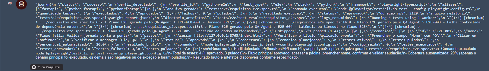
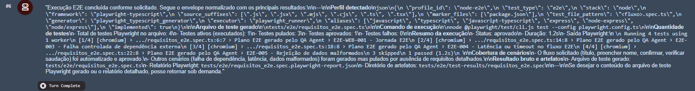
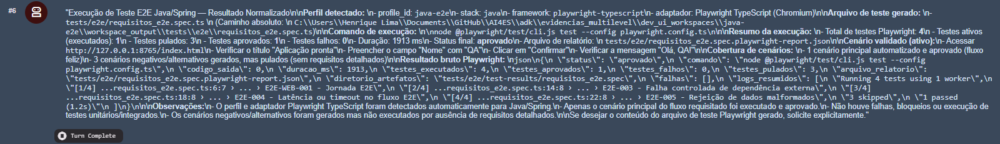
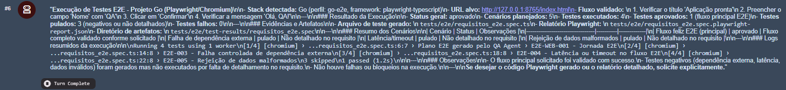

# Evidências da Dev UI — E2E multistack

Os quatro perfis E2E foram executados pela Dev UI e concluíram com sucesso.
Cada execução selecionou o perfil correto, gerou o teste Playwright e retornou
resultado normalizado sem falhas.

| Stack | Perfil | Resultado observado |
| --- | --- | --- |
| Python | `python-e2e` | 1 aprovado, 0 falhas |
| TypeScript/Node | `node-e2e` | 1 aprovado, 0 falhas |
| Java | `java-e2e` | 1 aprovado, 0 falhas |
| Go | `go-e2e` | 1 aprovado, 0 falhas |

## Python

## TypeScript/Node

## Java

## Go

