# Evidências da Dev UI — testes unitários multistack

Os prints abaixo registram a detecção automática do perfil e a execução dos
testes unitários nas sete configurações suportadas. Caminhos locais com o nome
do usuário foram ocultados; os resultados técnicos foram preservados.

| Perfil | Resultado evidenciado |
| --- | --- |
| `python-pytest` | 10 testes aprovados e 100% de cobertura |
| `node-vitest` | 13 testes aprovados |
| `node-jest` | 13 testes aprovados e 100% de cobertura |
| `node-node-test` | 12 testes aprovados |
| `node-mocha` | 13 testes aprovados |
| `java-junit` | falha inicial corrigida automaticamente; 12 testes aprovados ao final |
| `go-testing` | 21 testes aprovados e 100% de cobertura |

## Python — pytest

Detecção, resultado e cobertura:

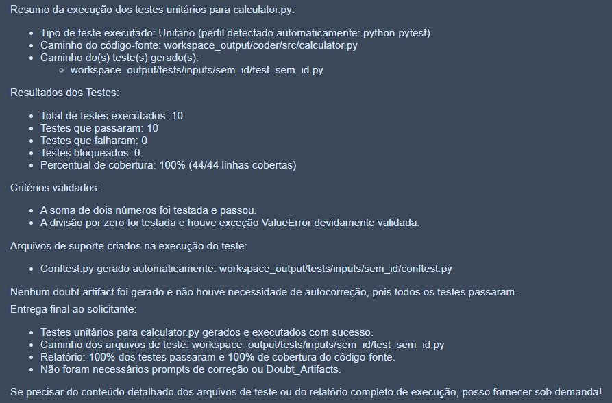

Retorno estruturado da execução:

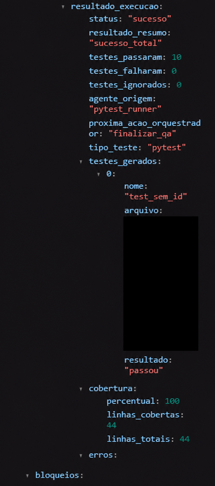

## Node/TypeScript — Vitest

Detecção do perfil e resumo:

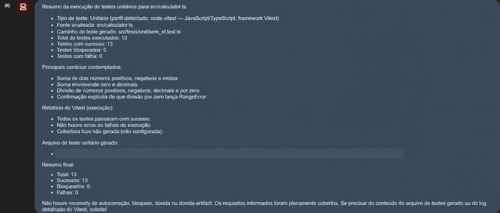

Retorno estruturado da inspeção:

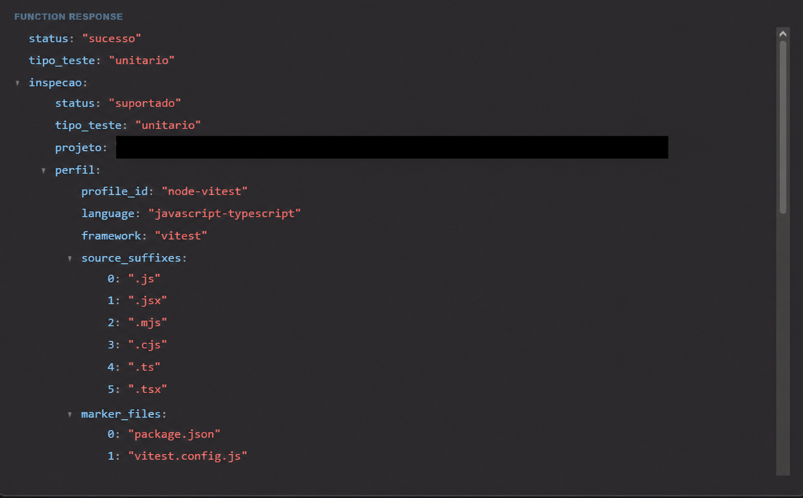

## Node/TypeScript — Jest

Detecção do perfil e resumo:

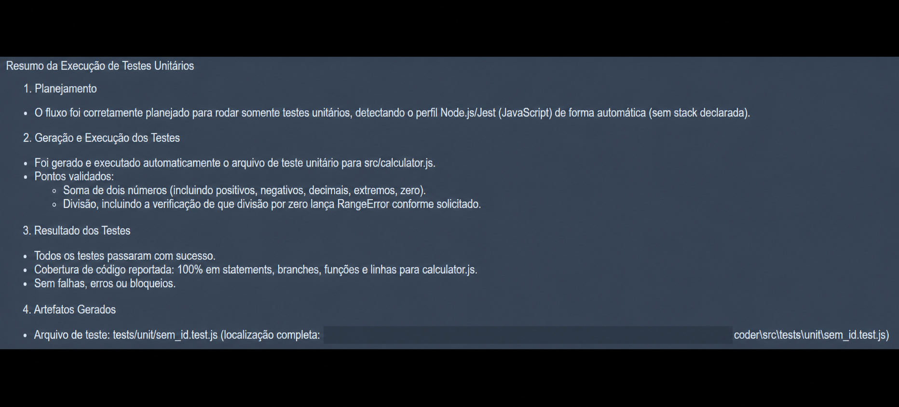

Saída do Jest e cobertura:

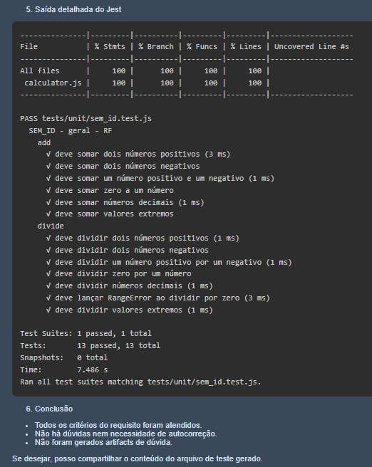

## Node — node:test

Detecção do perfil e resumo:

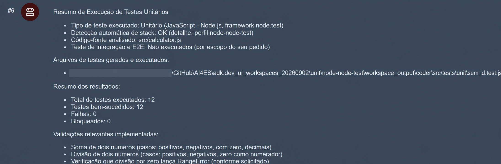

Retorno estruturado da execução:

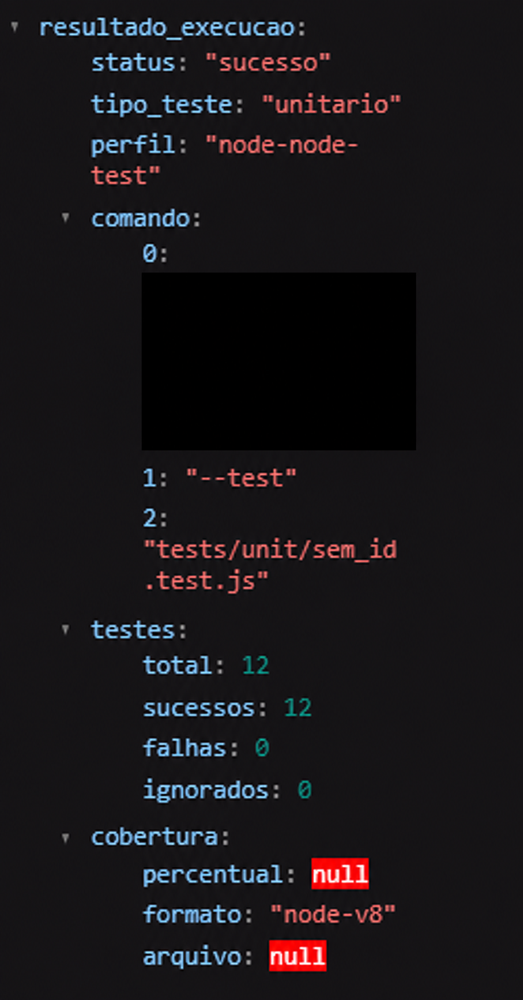

Lista de testes executados:

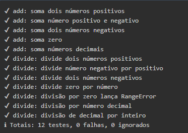

## Node — Mocha

Detecção do perfil, execução e resumo:

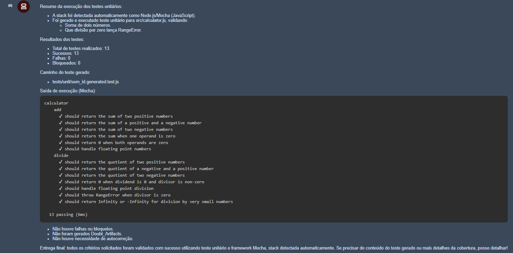

Retorno estruturado da execução:

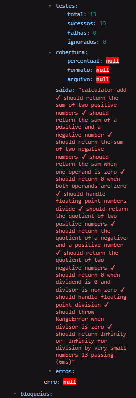

## Java — JUnit

O primeiro ciclo encontrou uma falha de asserção. O Code Fix alterou somente o
teste, reexecutou o JUnit e concluiu com 12 testes aprovados.

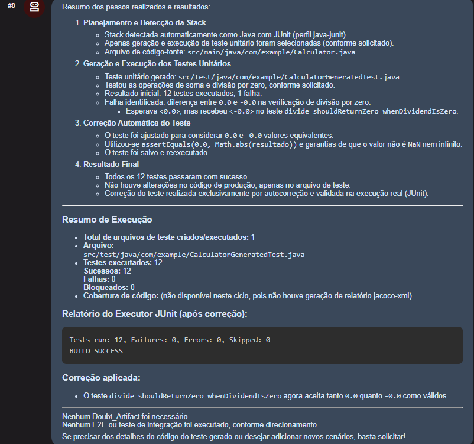

Falha inicial que acionou a autocorreção:

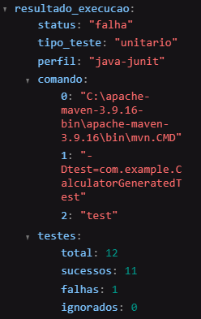

## Go — testing

Detecção do perfil, resultado e cobertura:

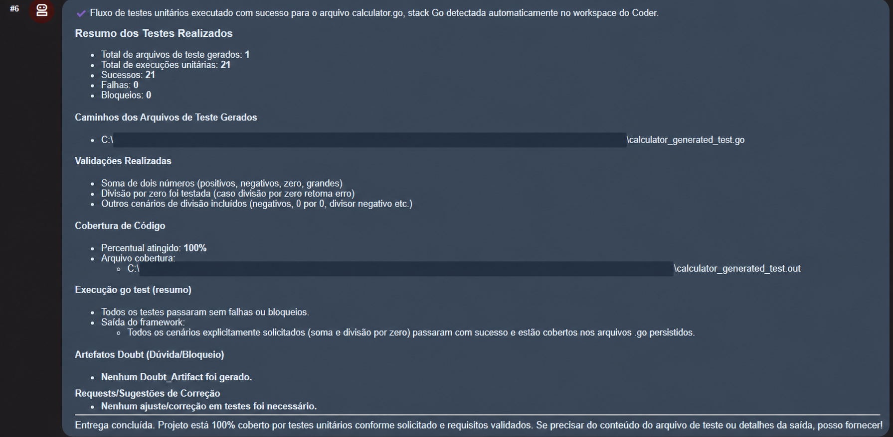

Retorno estruturado da execução:

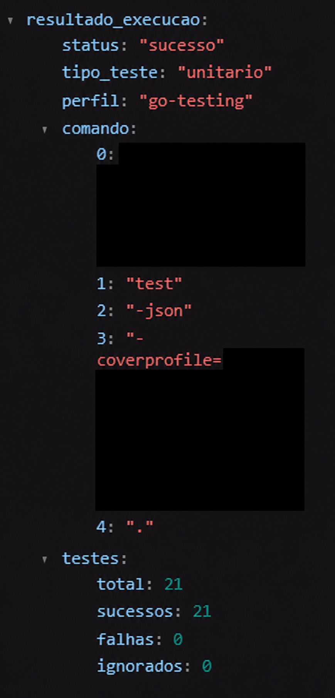
