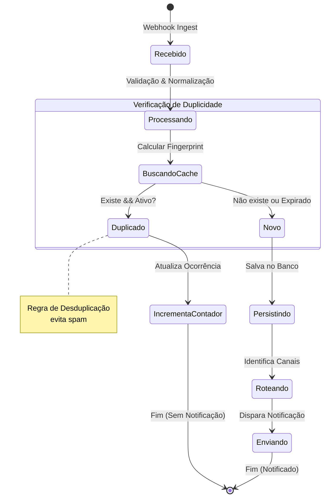

# Especificação Técnica: AlertService (CriticalEvent)

Este documento detalha os requisitos e especificações para o microsserviço `AlertService`, responsável pela ingestão, processamento e notificação de incidentes no sistema CriticalEvent.

## 1. Elicitação de Requisitos

### Requisitos Funcionais (RF)

*   **RF01 - Ingestão de Webhooks:** O serviço deve expor um endpoint HTTP (REST) para receber payloads de alertas de ferramentas de monitoramento externas (ex: Prometheus, Grafana, Datadog).
*   **RF02 - Normalização de Dados:** O serviço deve converter payloads de diferentes fontes para um formato interno padronizado (JSON Schema).
*   **RF03 - Desduplicação de Alertas:** O serviço deve identificar e agrupar alertas repetidos ou correlacionados dentro de uma janela de tempo configurável para evitar notificações redundantes.
*   **RF04 - Roteamento de Notificações:** O serviço deve encaminhar alertas para canais configurados (Slack, Email, PagerDuty) baseados na severidade e origem do alerta.
*   **RF05 - Gestão de Estado:** O serviço deve manter o estado do alerta (Disparado, Reconhecido, Resolvido) e atualizar os canais externos quando o estado mudar.
*   **RF06 - Autenticação de Origem:** O serviço deve validar a autenticidade das requisições de webhook (via API Key ou assinatura HMAC).

### Requisitos Não-Funcionais (RNF)

*   **RNF01 - Disponibilidade:** O serviço deve garantir disponibilidade de 99.9% (SLA), dado que é crítico para a operação.
*   **RNF02 - Performance (Latência):** O tempo de processamento desde o recebimento do webhook até o envio da notificação não deve exceder 2 segundos (P95).
*   **RNF03 - Escalabilidade:** O serviço deve suportar picos de até 10.000 alertas por minuto sem degradação do serviço (horizontal scaling).
*   **RNF04 - Segurança:** Todos os dados em trânsito devem ser criptografados (TLS 1.2+). Dados sensíveis (chaves de API de terceiros) devem ser armazenados criptografados em repouso.
*   **RNF05 - Observabilidade:** O serviço deve expor métricas (RED method) e logs estruturados para monitoramento da própria saúde.

---

## 2. Análise: Regra de Negócio de Desduplicação

**Regra de Negócio:**
Um novo alerta recebido é considerado duplicado se possuir a mesma `fingerprint` (hash gerado a partir de labels identificadores como `alertname`, `instance`, `severity`) de um alerta ativo ou recebido nos últimos X minutos (janela de desduplicação). Se duplicado, o contador de ocorrências é incrementado, mas uma nova notificação *não* é enviada, a menos que o estado do alerta mude (ex: de `firing` para `resolved`).

### Critérios de Aceitação (Gherkin)

```gherkin
Feature: Desduplicação de Alertas

  Scenario: Recebimento de alerta duplicado dentro da janela de tempo
    Given que um alerta com fingerprint "cpu-high-srv01" foi recebido e notificado às 10:00
    And a janela de desduplicação está configurada para 15 minutos
    When um novo alerta com fingerprint "cpu-high-srv01" é recebido às 10:05
    Then o sistema deve registrar a nova ocorrência no histórico do alerta original
    And o sistema NÃO deve enviar uma nova notificação para os canais configurados

  Scenario: Recebimento de alerta após a janela de tempo (novo incidente)
    Given que um alerta com fingerprint "mem-leak-app02" foi recebido e resolvido às 09:00
    When um novo alerta com fingerprint "mem-leak-app02" é recebido às 14:00
    Then o sistema deve tratar como um novo incidente
    And o sistema deve enviar uma nova notificação para os canais configurados

  Scenario: Atualização de severidade (exceção à desduplicação)
    Given que um alerta com fingerprint "disk-full-db01" e severidade "Warning" foi recebido
    When um novo alerta com fingerprint "disk-full-db01" é recebido com severidade "Critical"
    Then o sistema deve atualizar o alerta existente
    And o sistema deve enviar uma nova notificação informando a escalada de severidade
```

---

## 3. Priorização (MoSCoW) - Escopo MVP

| ID | Requisito | Prioridade | Justificativa |
| :--- | :--- | :--- | :--- |
| RF01 | Ingestão de Webhooks | **Must Have** | Funcionalidade core; sem isso não há dados. |
| RF03 | Desduplicação de Alertas | **Must Have** | Essencial para evitar fadiga de alertas (alert fatigue). |
| RF04 | Roteamento (Slack apenas) | **Must Have** | MVP foca em um canal principal de comunicação. |
| RNF01| Disponibilidade 99.9% | **Must Have** | Sistema crítico, não pode falhar silenciosamente. |
| RF06 | Autenticação de Origem | **Should Have** | Importante para segurança, mas pode ser mitigado por firewall no MVP inicial. |
| RF05 | Gestão de Estado | **Should Have** | Importante, mas MVP pode ser stateless (fire-and-forget) se necessário. |
| RF02 | Normalização (Genérica) | **Could Have** | Suporte a múltiplos formatos pode vir depois; focar em Prometheus primeiro. |
| RF04 | Roteamento (PagerDuty/Email)| **Could Have** | Canais adicionais podem ser implementados na v2. |
| - | Interface Gráfica de Config | **Won't Have** | Configuração via arquivo YAML/Env Vars é suficiente para o MVP. |

---

## 4. Modelagem: Ciclo de Vida do Alerta



---

## 5. Validação e Verificação

**Análise de Conflitos:**
*   **Latência (RNF02) vs Consistência/Persistência:** A exigência de desduplicação requer consulta a um estado anterior (banco de dados ou cache distribuído). Para manter a latência baixa (<2s) e alta disponibilidade, recomenda-se o uso de um cache rápido (ex: Redis) para a verificação de duplicidade, aceitando uma consistência eventual na persistência de longo prazo (banco relacional/NoSQL) se necessário.
*   **Segurança (RNF04) vs Performance:** A criptografia e validação de assinaturas adicionam overhead. O impacto deve ser medido, mas a segurança é inegociável para este tipo de serviço.

**Cobertura de Erros nos Critérios de Aceitação:**
*   Os cenários atuais cobrem o "caminho feliz" e a lógica principal de negócio.
*   *Melhoria:* Adicionar cenários para falhas, como "Falha ao enviar notificação para o Slack" (deve haver retentativa/DLQ) ou "Payload malformado" (deve retornar erro 400 e não processar).

---

## 6. Documentação

Este documento serve como a especificação técnica inicial para o desenvolvimento do `AlertService`. A arquitetura deve priorizar a desacoplagem (uso de filas para notificações) para garantir que a ingestão de alertas (RF01) nunca seja bloqueada por lentidão nos canais de terceiros (Slack/Email).
