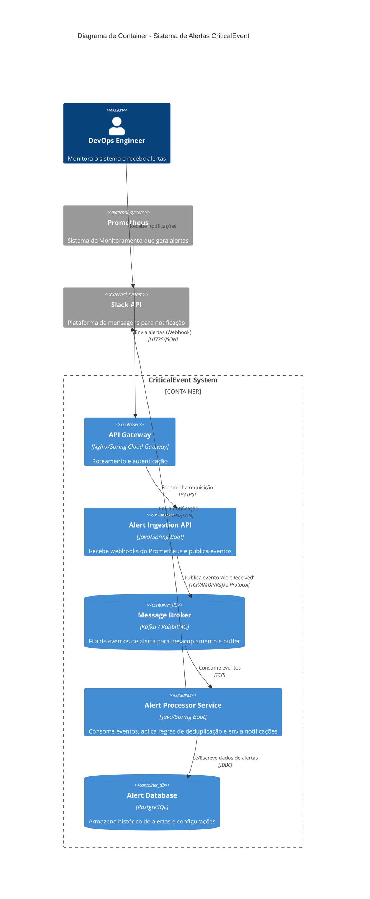

# Arquitetura de Solução - AlertService

## 1. Design de Arquitetura (C4 Container - Nível 2)

O diagrama abaixo ilustra a arquitetura proposta para o `AlertService` dentro do ecossistema CriticalEvent.

## 2. Decisão Arquitetural: Síncrono vs. Assíncrono

**Recomendação:** Arquitetura **Assíncrona (Event-Driven)** para a ingestão e processamento.

**Justificativa:**
Para atender ao requisito de processar "picos de milhares de alertas por segundo sem perder mensagens", a abordagem assíncrona é fundamental.
1.  **Desacoplamento Temporal:** O `Prometheus` (ou qualquer fonte) não precisa esperar o processamento completo (salvar no banco, chamar Slack) para receber um `200 OK`. A API de Ingestão apenas valida e coloca na fila.
2.  **Nivelamento de Carga (Load Leveling):** Picos de tráfego são absorvidos pelo Message Broker (Kafka/RabbitMQ). O `Alert Processor` consome as mensagens em seu próprio ritmo, protegendo o banco de dados e a API do Slack de sobrecarga (Rate Limits).
3.  **Alta Disponibilidade:** Se o `Alert Processor` cair ou estiver lento, as mensagens persistem no Broker e são processadas assim que o serviço voltar, garantindo zero perda de dados.

## 3. Avaliação de Trade-offs

### Abordagem Escolhida: Assíncrona (Event-Driven)
*   **Prós:**
    *   **Escalabilidade:** Produtores e consumidores podem escalar independentemente.
    *   **Resiliência:** Falhas no processamento não impactam a recepção (ingestão) dos alertas.
    *   **Responsividade:** O cliente (Prometheus) recebe resposta rápida de confirmação de recebimento.
*   **Contras:**
    *   **Complexidade:** Requer infraestrutura adicional (Broker) e gerenciamento de filas/tópicos.
    *   **Consistência Eventual:** O alerta pode levar alguns milissegundos/segundos a mais para aparecer no dashboard ou Slack.
    *   **Debug:** Rastrear uma transação distribuída é mais complexo (exige Distributed Tracing).

### Alternativa Rejeitada: Síncrona (API REST Direta)
*   **Prós:**
    *   **Simplicidade:** Menos peças móveis, fluxo de controle linear e fácil de entender.
    *   **Feedback Imediato:** O cliente sabe na hora se o alerta foi processado com sucesso total.
*   **Contras:**
    *   **Acoplamento Temporal:** Se o Slack estiver lento, toda a requisição trava.
    *   **Risco de Perda de Dados:** Em caso de crash do serviço durante um pico, requisições em memória são perdidas.
    *   **Gargalos:** O banco de dados ou APIs externas tornam-se gargalos diretos para a ingestão.

## 4. Padrões Arquiteturais de Resiliência

Para garantir a robustez do `AlertService`, os seguintes padrões devem ser aplicados:

1.  **Dead Letter Queue (DLQ):**
    *   **Onde:** No consumo do Message Broker.
    *   **Por que:** Mensagens que falham repetidamente (ex: formato inválido, erro de lógica irrecuperável) devem ser movidas para uma fila separada para análise manual, evitando que travem o processamento da fila principal (head-of-line blocking).

2.  **Retry com Exponential Backoff:**
    *   **Onde:** Nas chamadas ao Banco de Dados e APIs externas (Slack).
    *   **Por que:** Falhas transientes (ex: timeout de rede) são comuns. Tentar novamente com intervalos crescentes (ex: 1s, 2s, 4s) resolve a maioria desses problemas sem sobrecarregar o destino.

3.  **Circuit Breaker:**
    *   **Onde:** Na integração com o Slack e outros canais de notificação.
    *   **Por que:** Se a API do Slack estiver fora do ar ou lenta, o Circuit Breaker "abre" e falha rápido as requisições subsequentes, impedindo que threads do `Alert Processor` fiquem presas aguardando resposta e consumindo recursos do sistema.

4.  **Bulkhead (Anteparos):**
    *   **Onde:** Isolamento de pools de threads para diferentes canais de saída.
    *   **Por que:** Garante que um problema no envio de e-mails (lento) não afete o envio de mensagens para o Slack.
