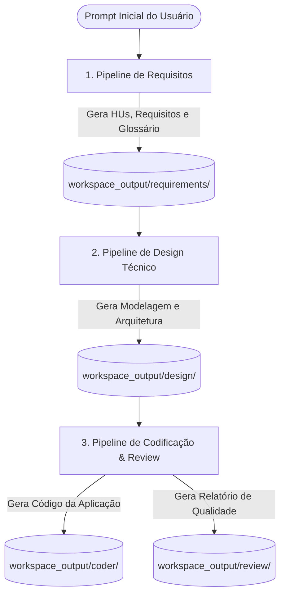

# Documentação dos Entregáveis — SDLC Pipeline (AI4ES)

Esta documentação resume tudo o que foi gerado pelo processo automatizado de desenvolvimento de software (SDLC) no diretório `adk/workspace_output`. O foco é explicar de forma executiva (ideal para apresentações) o que é cada entrega, quem a gerou e qual a lógica de sua criação.

---

## 📊 Visão Geral do Fluxo de Produção

O desenvolvimento da aplicação passou por um fluxo linear onde a saída de cada etapa serviu como insumo para a etapa seguinte. Abaixo, o diagrama simplificado ilustra as etapas e as entregas:

---

## 📁 Detalhamento de Entregas por Etapa

### 1. Especificação de Requisitos (Time 1)
* **O que foi gerado**:
  * **4 Histórias de Usuário (HUs)**: [HU-001.md](file://wsl.localhost/Ubuntu/home/hhiroshi92/github/AI4ES/adk/workspace_output/requirements/HUs/HU-001.md) a [HU-004.md](file://wsl.localhost/Ubuntu/home/hhiroshi92/github/AI4ES/adk/workspace_output/requirements/HUs/HU-004.md) que descrevem as funcionalidades do ponto de vista do usuário final (ex: galeria de fotos, upload, gerenciamento de álbuns).
  * **25 Requisitos Funcionais (RFs)**: Documentos de especificação técnica atômica detalhando o comportamento esperado do sistema (ex: validação de formato de imagem, limite de tamanho, rotas específicas).
  * **14 Requisitos Não Funcionais (RNFs)**: Critérios operacionais como segurança, desempenho e estilo visual.
  * **4 Regras de Negócio (RNs)**: Regras que o sistema deve cumprir obrigatoriamente (ex: restrições de permissão).
  * **Glossário Técnico**: [Glossario.md](file://wsl.localhost/Ubuntu/home/hhiroshi92/github/AI4ES/adk/workspace_output/requirements/Glossario.md) com os termos e definições comuns do projeto.
* **Quem gerou**: `requirements_pipeline` (compondo o `requirements_agent` e o `glossario_agent`).
* **Como foi gerado**: O pipeline pegou a ideia original do usuário e a estruturou sob padrões de Engenharia de Software. Cada requisito foi ativado de forma independente e catalogado em arquivos separados em formato Markdown para fácil leitura e rastreabilidade.

---

### 2. Design e Arquitetura Técnico (Time 2)
* **O que foi gerado**:
  * **Análise Técnica**: [analise_tecnica_HU-001_HU-002_HU-003_HU-004.md](file://wsl.localhost/Ubuntu/home/hhiroshi92/github/AI4ES/adk/workspace_output/design/analise_tecnica_HU-001_HU-002_HU-003_HU-004.md) descrevendo a modelagem do banco de dados, endpoints de API e lógica de navegação.
  * **Artefatos de Dúvida (Doubt Artifacts)**: [Doubt_Artifact_HU-001_2026-05-18.md](file://wsl.localhost/Ubuntu/home/hhiroshi92/github/AI4ES/adk/workspace_output/design/Doubt_Artifact_HU-001_2026-05-18.md) apontando ambiguidades encontradas nos requisitos e que precisam de alinhamento com o usuário.
* **Quem gerou**: `design_pipeline` (compondo `design_architect`, `markdown_specialist` e `validator`).
* **Como foi gerado**: Os agentes de design mapearam as HUs geradas na Fase 1 em uma solução técnica viável. Quando o `validator` ou o `design_architect` encontram um impedimento ou indefinição (como regras de negócio conflitantes ou dados de entrada incompletos), o sistema aciona o modo defensivo e cria um artefato de dúvida para impedir que o desenvolvedor "adivinhe" e crie um código incorreto.

---

### 3. Código-Fonte da Aplicação (Time 4)
* **O que foi gerado**:
  * **Aplicação FastAPI completa** (Galeria/Álbum de Fotos):
    * [main.py](file://wsl.localhost/Ubuntu/home/hhiroshi92/github/AI4ES/adk/workspace_output/coder/app/main.py): Lógica de rotas (upload de imagens, visualização de álbuns, detalhe da imagem).
    * [models.py](file://wsl.localhost/Ubuntu/home/hhiroshi92/github/AI4ES/adk/workspace_output/coder/app/models.py): Banco de dados em SQLite/Pydantic mapeando os álbuns e fotos.
  * **Interface Visual (Templates e Estilos)**:
    * Arquivos HTML baseados em Jinja2 (como `base.html`, `index.html`, `album_list.html`, `upload.html`) sob o diretório [templates](file://wsl.localhost/Ubuntu/home/hhiroshi92/github/AI4ES/adk/workspace_output/coder/app/templates).
    * Folha de estilo CSS: [style.css](file://wsl.localhost/Ubuntu/home/hhiroshi92/github/AI4ES/adk/workspace_output/coder/app/static/style.css).
  * **Suíte de Testes Locais**:
    * Arquivos de configuração de teste ([conftest.py](file://wsl.localhost/Ubuntu/home/hhiroshi92/github/AI4ES/adk/workspace_output/coder/conftest.py)) e os testes automatizados da aplicação ([test_main.py](file://wsl.localhost/Ubuntu/home/hhiroshi92/github/AI4ES/adk/workspace_output/coder/tests/test_main.py)).
* **Quem gerou**: `cr_coder_agent` (módulo de geração de código).
* **Como foi gerado**: O agente de codificação traduziu as especificações técnicas da análise de design em código Python real. Ele seguiu um contrato rígido de estrutura de pacotes Python para assegurar que a suíte de testes funcione sem erros de importação e configurou a aplicação com interface HTML funcional para interação.

---

### 4. Relatório de Revisão de Código (Time 4)
* **O que foi gerado**:
  * **Relatório de Revisão**: [verificacao_revisao.md](file://wsl.localhost/Ubuntu/home/hhiroshi92/github/AI4ES/adk/workspace_output/review/verificacao_revisao.md) que lista bugs pontuais, conformidade com os requisitos e sugestões de melhoria.
* **Quem gerou**: `cr_review_agent` (compondo os sub-agentes `cr_review_analyzer` e `cr_review_persister`).
* **Como foi gerado**: O sub-agente `cr_review_analyzer` analisou cada linha de código gerada pelo programador na Fase 3 sob a ótica de boas práticas de programação e segurança. Em seguida, o `cr_review_persister` consolidou essas análises em um documento de revisão, agindo como um "gatekeeper" da qualidade do código antes do deploy.

---

## 🎯 Destaques para a Apresentação

Se você for apresentar este fluxo para uma equipe ou gerência, destaque os seguintes pontos de inovação do projeto:
1. **Rastreabilidade de Ponta a Ponta**: É possível mapear qual Requisito Funcional (RF) originou qual linha de código em `main.py` e qual teste valida essa função.
2. **Desenvolvimento Seguro (Anti-Alucinação)**: Se o cliente enviar requisitos ambíguos, o sistema gera o `Doubt_Artifact` (Etapa 2) solicitando feedback, em vez de inventar uma lógica incorreta.
3. **Divisão Especializada de Trabalho**: Os robôs operam como um time de verdade (um define os requisitos, outro projeta a arquitetura, outro programa e outro testa/revisa de forma crítica).
